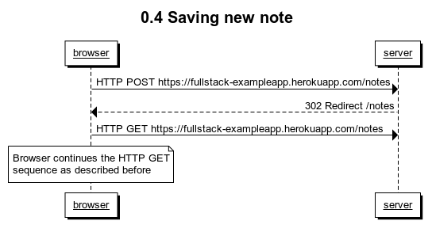

# Sequence diagram exercises
contains

- algorithms (below)
- code to generate pictures: code
- pictures

## Algorithms in clear text

### 0.4



```
Client: User inputs text to the textbox (saved in the client)
Client: User presses form submit
Client -> Server: POST /new_note
Server -> Client: 302 redirect /notes
-- client re-renders the page (follows the exact same sequence as in the example)
-- by doing GET /notes (and subsequent GETs)
```

### 0.5


```
Client -> Server: GET /notes
Server -> Client: 200: with html body
client -> server: GET /main.css
Server -> Client: 200: with css body
client -> server: GET /spa.js
Server -> Client: 200: with js body
client : execute spa.js
client -> server : GET /data.json
Server -> Client: 200: with json body
```


### 0.6


```
Client: User inputs text to the textbox (saved in the client)
Client: User presses form submit
Client: Renders the new note based on what it is going to send to the server
-- This step should be after we receive 201
Client -> Server: POST /new_note with json_body
Server -> Client: 201 created : with json_body
-- No further transactions
```
